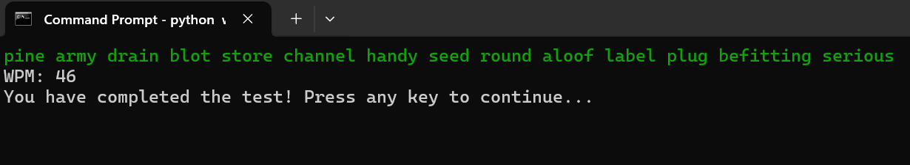

# ⌨️ wpm-typing-test
A terminal-based typing speed test application built with Python and curses. Test your words-per-minute (WPM) typing speed with randomly generated text passages.

---

## 🚀Features

- Real-time WPM calculation - See your typing speed update as you type
- Color-coded feedback - Correct characters appear in green, mistakes in red
- Random text generation - Each test uses a randomly selected passage of 10-15 words
- Backspace support - Correct mistakes as you type
- Continuous testing - Take multiple tests in one session
- Clean terminal interface - Minimalist design focused on the typing experience

---

## 📷 Preview




---

## 🧠 How it Works

1. A list of words is imported from a separate `words.py` file.
2. The program generates a random sentence using 10–15 words.
3. As you type:
   - Correct characters are shown in green.
   - Incorrect characters are shown in red.
   - WPM updates in real-time.
4. Once you complete the sentence correctly, a "Test Complete" message is shown.

---

## 🔨 Installation

Clone this repository:

```
git clone https://github.com/KanchanP333/wpm-typing-test.git
cd wpm-typing-test
```

Ensure you have the required files:

- main.py (or your main script file)
- words.py (containing the words array)


Run the program:

```
python main.py
```

---
## 🪴Usage

- Start the test: Press any key at the welcome screen
- Type the displayed text: Characters will appear in green when correct, red when incorrect
- Use backspace to correct mistakes
- Complete the passage to see your final WPM score
- Continue or exit: Press any key to take another test, or ESC to quit

---

## 🎮 Controls

- Any printable character: Type the character
- Backspace: Delete the last character
- ESC: Exit the current test or quit the application

---

## ⚙️Technical Details

- Built with Python's curses library for terminal manipulation
- Uses time module for accurate timing calculations
- Implements non-blocking input with stdscr.nodelay(True)
- Handles various backspace key representations across different terminals

